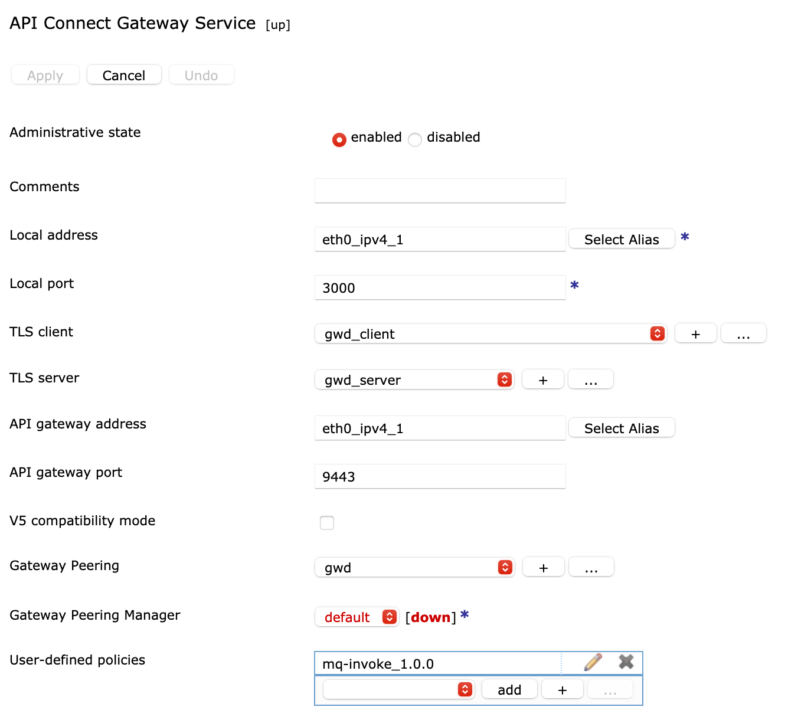
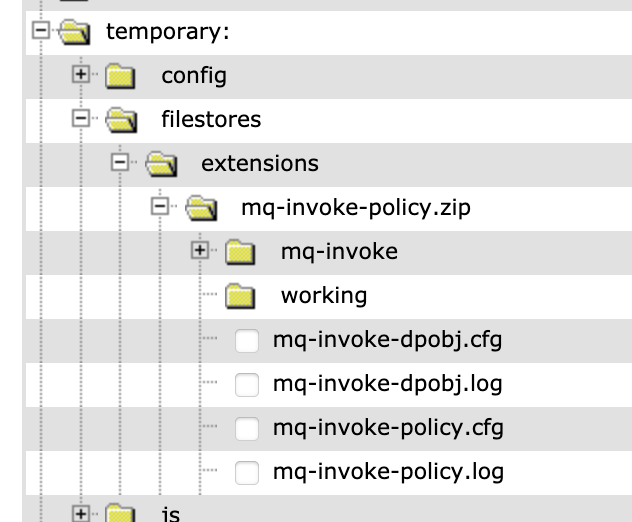
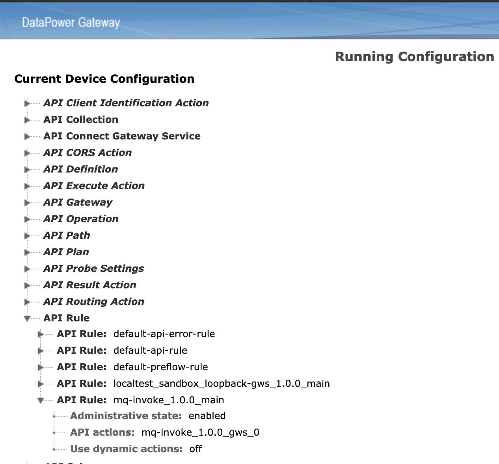

# User Defined Policies (UDP) in API Connect V10.

This tutorial target UDP for API Gateway which is the gateway introduced in V10 and uses native DP implementation.

The purpose of this asset is to help deploying an UDP on APIC V10.

To illustrate this example of UDP policies are provided.

## UDP Principle
### Introduction

UDP is a user defined policy that is made available as a new policy in the API Connect manager UI and made available on the gateway.

From V2018 DataPower, the API Connect Gateway, has been enhanced with new native objects to address API management capabilities. It is now known as **API Gateway** and it is made of native DataPower objects. 

From V10 two types of User Defined Policies (UDP) are available: the catalog and global scoped UDP.

The difference is described in the KC at [Authoring policies](https://www.ibm.com/docs/en/api-connect/10.0.x?topic=policies-authoring-datapower-api-gateway):  
   
#### catalog scoped   
- Available in the UI for the API developer. To make it available you need to deploy the policy in the sandbox
- Has to be deployed in each catalog where the API using the UDP is published
- made of:  
  - prebuilt API Connect policies (invoke, gatewayscript, xslt, ...) defined within an assembly (just as a normal API assembly)
  - DataPower processing rule that has been exported
- non default DataPower objects used by the processing rule or Actions have to be created before.

To create this UDP, the user needs to be part of a **provider organization** and have access to the catalog where the UDP has to be deployed. 

#### global scoped 
- Available in the UI for the API developer. 
- Available for the whole gateway service (all catalog configured with this gateway service will be able to use it).
- made of any DataPower objects. The objects are created using a configuration file.
- processing rule can be called from a gatewayscript 

With this policies, it is possible to provide configuration file containing DataPower commands that are used to create DataPower objects used by the UDP. For example the mq-invoke UDP uses a queue manager object that is created with a configuration file.

From KC:
> A configuration sequence is a script-based way to create, modify, and delete configurations on the DataPower® Gateway.

Configuration files can be found in config, local and temporary/config.

To create this UDP, the user needs to be part of the **admin organization** and have the right to deploy the UDP. 

### Available functions

Any DataPower capabilities can be used from a UDP:
- XSLT 
- GatewayScript
- Processing rules called from an XSLT or Gatewayscript
- Assembly actions

It is good to know that all of these capabilities can be used directly in an assembly as well, the UDP just made a wrapper around the actions that you have defined allowing easy reuse.

DataPower objects can be created along with your assembly UDP when the extension is created (when using the global scope UDP). Like for example in this repository there is the mq-invoke global UDP to access a queue manager. The UDP is packaged with a configuration file that is creating a mq-qm object to connect to a remote queue manager. This queue manager object is then used in the gatewayscript using an url-open.

#### Processing rules
Those can be called from a gatewayscript using the `multistep`library as documented in the 
[KC multistep](https://www.ibm.com/support/knowledgecenter/SS9H2Y_7.7.0/com.ibm.dp.doc/multistep_js.html)

```javascript
var ms = require ('multistep');

var inputMessage = context.createMessage('inputCtx');
inputMessage.body.write('{"myJSONPayload":"MyPayload"}');


// Input of multistep is the name of a message object. And the messageObj.body is the payload
// outputCtx will be a message object containing the response
try {
    ms.callRule ('myRuleName', 'inputCtx', 'outputCtx', 
      function(error) {
          var result = null;

          if (error) {
              //check if output context variable is defined
              if (outputCtx != '') {
                console.info("output context %s", JSON.stringify(outputCtx));
              }
                console.error(error);
                session.output.write(error);
          } else if (outputCtx != '') {
              console.info("writing result %s", result);
              session.output.write(context.get(outputCtx.body));
          }
      }
    );
} catch (error) {
    console.error(error);
    session.output.write(error);
}
```

```javascript
var ms = require('multistep');

var fooObj = context.createMessage('foo');
var barObj = context.createMessage('bar');

fooObj.body.write('HelloWorld');
fooObj.header.set('Header1', 'myHeader');
fooObj.setVariable('Var1', 'myVar');

ms.callRule('rule1', 'foo', 'bar', function(error) {
  barObj.body.readAsBuffer(function(error, buf) {
    var OutputPayload = buf.toString();
    var OutputHeaders = barObj.header.get();
    var OutputVar1 = barObj.getVariable('Var2');
  });
});

```
# Global scoped UDP 

## Introduction

When setting up an API Gateway with API Connect, the *API Connect Gateway Service* object in DataPower retrieves the extension package zip containing all the configurations from API Connect.

The assembly objects or DataPower objects are created using DataPower commands made available in a configuration file. All available commands can be found at the following link:
[KC commands](https://www.ibm.com/docs/en/datapower-gateways/10.0.x?topic=reference-commands)

The following example show how to create an assembly gatewayscript object that can then be used in an assembly:

```yaml
assembly-gatewayscript "mq-invoke_1.0.0_gws_0"
 reset
 title "MQ Invoke"
 correlation-path "$.x-ibm-configuration.assembly.execute[0]"
 gatewayscript-location "temporary:///filestores/extensions/gateway-extension/mq-invoke/mq-invoke-code.js"
exit
```

The API Gateway are using API objects that are assemble using the following hierarchical structure:

      |- API definition Object (1 API Assembly)
          |- API Assembly (1 API rule)
              |- API Rule (1-n API actions/functions)
                  |- API Assembly Actions (prebuilt API Connect actions)
                  |- API Assembly functions
                      |- API Assembly function
                      |- API Assembly


The assembly can be made of api rules which are made of API assembly actions (predefined policy provided with API Connect like "set-var", "gatewayscript") and API assembly functions.
The *API Assembly function* is used to define an UDP, it specifies   
- the parameters that will be provided to the end user using the UI 
- the assembly to call.   

The gatewayscript or XSLT action can use native DataPower objects like MQ Object or processing rule. Some native objects can be called only from gatewayscript or xslt.

The configuration file that contains the commands to create the DP objects is made available to the gateway using the gateway extension feature.
For example the Assembly GatewayScript Action can be created using:

```yaml
assembly-gatewayscript "mq-invoke_1.0.0_gws_0"
 reset
 title "MQ Invoke"
 gatewayscript-location "temporary:///filestores/extensions/gateway-extension/mq-invoke/mq-invoke-code.js"
exit

```

- reset is a command to set the value to default
- title command creates the title
- gatewayscript-location command defines where the gws file is located 

When an UDP is deployed, it will be added as *user-defined policy* on API Connect Gateway Service.



The API Gateway Service will tell API Connect that there are new policies available and it will be made available in the API Manager UI.

UDP configurations are stored as part of gateway extensions at temporary:///config/filestores/extensions/gateway-extension as shown at the following picture:


Information on how to package your UDP and some example is provided in the [KC UDP global scoped](https://www.ibm.com/docs/en/api-connect/10.0.1.x?topic=apdag-defining-packaging-global-scoped-user-defined-policy-datapower-api-gateway)
 

> Viewing running configuration can be useful to see what is configured: : Troubleshooting -> Advanced -> View running config


## Packaging

This section explains the contents of the MQ-Invoke UDP provided in this project. The artifacts are available under the assets/mq-invoke directory.

The asset contains
- configuration file to build the UDP API assembly - `mq-invoke-policy.cfg`.
- configuration file to build the queue manager object - `mq-invoke-dpobj.cfg`
- the gatewayscript used by the gatewayscript action to call mq using url-open and made use of the dp queue manager object.

The hierarchy call structure of a UDP assembly is:
  
      |- API Assembly function : assembly-function "mq-invoke_1.0.0"
          |- API Assembly: assembly "mq-invoke_1.0.0"
              |- API Rule: api-rule "mq-invoke_1.0.0_main"
                  |- API Assembly Action: assembly-gatewayscript "mq-invoke_1.0.0_gws_0"


Only one package extension can be created on one gateway service. This package (a zip file) can contain multiple extensions. The extension zip file can be created, updated and deleted.  
With the API Gateway in V10, it is possible to provide a gateway extension manifest that allows to add deploy multiple extensions and specify if they have to be activated straight away or after an api gateway restart (deferred).

The manifest file is a json file and has to be at the root level of the package zip file.
The available properties for this manifest are described in the [Gateway extensions manifest](https://www.ibm.com/docs/en/api-connect/10.0.x?topic=gateway-extensions-manifest) page.

The configuration file used to build the UDP API assembly contains all the commands to created the API objects. These objects are described here after.

The structure of the extension file is as follow:   
  
    |- extension.zip  
      |- manifest.json  
      |- [myPolicy.zip]
         |- myPolicyAssembly.cfg
         |- myPolicyObject.cfg
         |- [myPolicy]
             |- myGatewayScript.js
             |- myfiles
### Manifest file
Example of the manifest file used for the mq-invoke policy:

```json
{
    "extension": {
        "properties": { 
          "deploy-policy-emulator": false
          }
        },
        "files": [
            {
                "filename":"mq-invoke-ext.zip",
                "deploy": "immediate",
                "type": "user-defined-policy"
            }
        ]
    }
}
```
### UDP Assembly configuration file
#### Assembly action

The example has only one Assembly Action: a gatewayscript file.

```yaml
assembly-gatewayscript "mq-invoke_1.0.0_gws_0"
 reset
 title "MQ Invoke"
 correlation-path "$.x-ibm-configuration.assembly.execute[0]"
 gatewayscript-location "temporary:///filestores/extensions/gateway-extension/mq-invoke/mq-invoke-code.js"
exit
```

The __correlation-path__ command is only used for debugging purpose. And the __x-ibm-configuration__ object has a specific structure that has different elements:
enforced, phase, testable, cors, activity-log, assembly.execute, gateway, ...
 
The packaged UDP zip file (see packaging UDP below), that contains the gatewayscript file, is unzipped on DataPower under the location "temporary:///filestores/extensions/gateway-extension".   
The folder `mq-invoke` is a standard folder in the zip containing the gatewayscript file.

It is possible to have multiple actions and data can be passed along the different actions using standard variable based on context object: `context.set('myvar')` or `context.get('myVar')`.

#### Assembly rule
There is only one rule. The rule defines the Assembly actions.

```yaml
api-rule "mq-invoke_1.0.0_main"
 reset
 action mq-invoke_1.0.0_gws_0
exit
```
You may have multiple actions defined as in this example:

```yaml
api-rule udp-basic_1.0.0_main
  reset
  action udp-basic_1.0.0_set-variable_0
  action udp-basic_1.0.0_gatewayscript_1
exit
```
#### Assembly
The assembly defines the rule to be called:

```yaml
assembly udp-basic_1.0.0
  reset
  rule udp-basic_1.0.0_main
exit
```
#### Assembly-function

The assembly function is the "API Manager UI interface" and it is used to 
- define the name of the policy that will be displayed in the manager UI assembly
- the parameters that will be displayed as user parameter of the policy assembly
- to define what assembly has to be called

``` yaml
assembly-function "mq-invoke_1.0.0"
 reset
 title "MQ put"
 parameter
   name "qmgrObj"
   label "QMgr Object"
   description "gateway qmgr object"
   value-type string
   value "mainmqm"
 exit
 parameter
   name "variableName"
   label "variableName"
   description "name of the variable that contains the payload"
   value-type string
   value "mqmsgdata"
 exit
 parameter
   name "varOutputName"
   label "varOutputName"
   description "name of the variable for the response"
   value-type string
   value "message.body"
 exit 
 parameter
   name "queue"
   label "Queue"
   description "The Queue to be used"
   value-type string
 exit
 parameter
   name "format"
   label "Format"
   description "Format"
   value-type string
   value "MQSTR"
 exit
 assembly mq-invoke_1.0.0
exit
```

Parameters defined by this assembly function call can be accessed in the different API assembly Action using the **local** object: `local.parameter.MyParam`.
For instance the gatewayscript can access the queue parameter value using: `context.get('local.parameter.queue')`.

#### Adding UDP to API Gateway Service

```yaml
apic-gw-service
  user-defined-policies mq-invoke_1.0.0
exit
```

#### OpenAPI file example

The yaml file *mq-policy_1.0.0.yaml* can be used as example on how to use the UDP policy in a API definition.
You can import the OpenAPI in APIC once the 
## Publishing the UDP

### steps
The UDP is deployed on the gateway as gateway extension. 
All the gateway extensions that you are building are deployed to a gateway as one zip package that contains all the extensions. 

To add a new extension you need to  
1. Get the old extension package (from a source repo or by getting it from the manager): if you had a previous extension, you will need to add the new extension to it.
2. Add the new extension to the existing package (it's a zip file)
3. Create or modify the manifest to reference the new UDP
3. Delete/Update the old extensions (all extensions are packages as one) from the gateway
4. Create again the gateway extensions using the cli/rest

### Extension-Package structure

The extension package zip file contains all your manifest (if defined, your UDP and your extension) ias follow:
  
    |- [extension.zip]  
       |- manifest.json  
       |- [myPolicy.zip]
          |- myPolicyAssembly.cfg
          |- myPolicyObject.cfg
          |- [myPolicy]
             |- myGatewayScript.js
             |- myfiles

The root level has the manifest file and all the extensions (or UDP) packaged as zip files.  
Each UDP extension zip file contains at root level the configuration files (.cfg) and any other files that you need to run your UDP. It is good practice to put your files (other than the cfg) into a sub directory having the same same name as your policy.

The extension package will be unzipped under `temporary:///filestores/extensions/` as shown at the following picture:   


The folder *mq-invoke-policy.zip*, which corresponds to the name of the zip file name used to package the UDP, contains the .cfg files (API assembly configuration and queue manager object configuration) and the gatewayscript.
In this example, the files used by the mq-invoke UDP have been placed under the folder "mq-invoke".

### Command to publish the UDP assembly

The package has been published using the CLI and example is provided when the [local test environment (lte)](https://www.ibm.com/docs/en/api-connect/10.0.x?topic=api-testing-local-test-environment) is used.   

For uses with LTE:
- mgmtHost: localhost:2000
- provider org: localtest
- admin user org (myAdminUser): admin
- admin realm: admin/default-idp-1
- org realm: provider/default-idp-2
- admin user: admin
- provider user: shavon
- availability zone: availability-zone-default
- gateway service: datapower-api-gateway

The different required parameters can be found using commands as described at the "useful commands" section.  

Here are the steps that can be performed to package and publish the UDP:
- Create the zip:

```sh 
zip mq-invoke-policy.zip *.cfg mq-invoke/*.js
zip extension-package.zip manifest.json *-policy.zip
```

- Login to the manager using the scope **admin** (example with lte)

```sh 
apic login --server mgmtHost --realm admin/myIdp -u myAdminUser
```
- Deploy the package with the command

```sh
apic gateway-extensions:create myPackage.zip --scope org --org admin --gateway-service myGatewayService --availability-zone availabilityZoneOfGatewaySrv -s mgmtHost
```
The organization has to be *admin*.

For the LTE environment we have

```sh
apic gateway-extensions:create extension-package.zip --scope org --org admin --gateway-service datapower-api-gateway --availability-zone availability-zone-default -s localhost:2000
```


To redeploy your UDP (if you make a change) follow the steps:
- delete the UDP: 
```sh
apic gateway-extensions:delete --scope org --org admin --gateway-service myGatewayService --availability-zone availabilityZoneOfGatewaySrv -s mgmtHost
```
- create the UDP


The deployment can take a little bit time (max 30 sec) to get the extension downloaded from the manager.
Once the extension files has been downloaded by the Gateway on the DataPower, the objects are created by the configuration sequence service.

The extension can be added automatically to the Gateway Service using a configuration command (adding the UDP to the GWS section). With the manifest you can tell the gateway service to enable it straight away or after a restart. 

> In a Kubernetes deployment, the configuration of the user defined policy can be automated using a config map.

Once the gateway service configured, the gateway will notify the manager that a user-defined policy is available and it will then appears in the assembly.

# UDP catalog scoped

## introduction
This type of UDP is easier to create and will be scoped to a catalog.
When an openAPI definition containing this UDP is published to a catalog, the UDP has to be created before.  
In order to be able to see this UDP in the manager UI or in the designer, the UDP has to be created in the sandbox catalog of the provider organization.   
The UDP is made of built-in API Gateway policies such as "set-var", "gatewayscript", ...  
The Gatewayscript can call a processing rule that would have been provided in the implementation folder (as DataPower export zip file).  

It's a great and easy way to package a processing assembly made of multiple actions as one policy and make it available to the developer through the manager UI. It easy the reusability.  
The UDP can be decorated with parameters that would be exposed to the API developer and can be used in the API assembly processing.


## packaging

You create the policy as described at the [defining catalog scoped UDP](https://www.ibm.com/docs/en/api-connect/10.0.x?topic=apdag-defining-packaging-catalog-scoped-user-defined-policy-datapower-api-gateway).  
The assembly part defines the API assembly processing actions as you would have when you build an OpenAPI assembly.  

The properties section of the UDP is used to define the properties that will be displayed to the API developer in the API manager UI or designer.  
These properties can be used in the API processing by using the context variable:  
in gws:
```js
var myProp= context.get("local.parameter.myProperty");
```
in xslt:
```xsl
<xsl:variable name="myProp" select="apigw:get-variable('local.parameter.targetBaseDN')"/>
```

The policy yaml file is zipped into a file.  
> If the UDP doesn't need any implementation such as a processing rule (because you are using DP functions in xslt/gws), the zip file **should** not contains any implementation folder.

## Publishing the UDP

This section provides the steps to publish the UDP.

If you are using a Local Test Environment (LTE), the default parameters are:
- mgmtHost: localhost:2000
- provider org: localtest
- admin user org (myAdminUser): admin
- admin realm: admin/default-idp-1
- org realm: provider/default-idp-2
- admin user: admin
- provider user: shavon
- availability zone: availability-zone-default
- gateway service: datapower-api-gateway

The different required parameters can be found using commands as described at the "useful commands" section.  

Here are the steps that can be performed to package and publish the UDP:  

- Create the zip:

```sh 
zip simple-udp.zip *.yaml
```

- Login to the manager using the scope **admin** (example with lte)

```sh 
apic login --server mgmtHost --realm admin/myIdp -u myAdminUser
```
- Deploy the policy zip with the command (lte example)

```sh
apiccli policies:create --catalog $myCatalog --configured-gateway-service  $gatewayService --org $providerOrg --server $mgmtHost --scope catalog $myPolicy.zip
```

If you want to have the policy shown in the API UI, the myCatalog should be **sandbox**.

If you need to update the policy, you can delete it and recreate.

The delete command is:

```sh
apiccli policies:delete $myPolicy:$version --catalog $myCatalog --configured-gateway-service  $gatewayService --org $providerOrg --server $mgmtHost --scope catalog
```

To get the right policy name and version, the following command can be used:

```sh
apiccli policies:list-all --catalog $myCatalog --configured-gateway-service  $gatewayService --org $providerOrg --server $mgmtHost --scope catalog
```

If you need to known what gateway service has been configured for a specific catalog:

```sh
apiccli configured-gateway-services:list -s l$mgmtHost --scope catalog -c $myCatalog --org $providerOrg
```


# Resources
 
 [User Defined Policies / Custom Policies in API Connect 2018 (MQ invoke Example)](https://chrisphillips-cminion.github.io/apiconnect/2020/03/16/CustomPoliciesAPIConnect2018.html)
 [GitHub - ozairs/apiconnect-policies](https://github.com/ozairs/apiconnect-policies)
 
 # Useful commands
 
To get the list of identity provider in the admin scope, you can use the following cli:

```sh
apic identity-providers:list --scope admin -s mgmtHost
```
To get the list of availability zone, the following cli can be used:

```sh
apic availability-zones:list --org admin -s $mgmt
```

And the list of gateway service in a particular availability zone:

```sh 
apic gateway-services:list --org admin --availability-zones availabilityZoneOfGatewaySrv -s $mgmt
```


